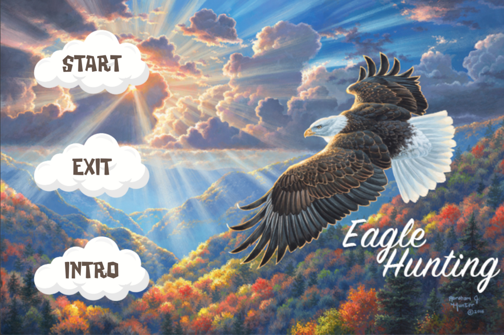
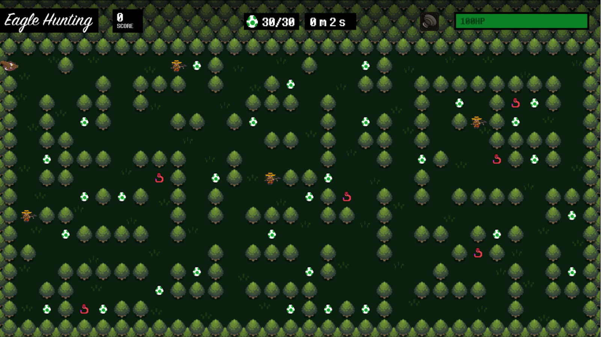

# Maze Game: Eagle Hunting

## Screenshots

## Gameplay Video
https://youtu.be/8QYLGLK3GZs

## Video Contest Tutorial (1st place winner)
https://youtu.be/eB-Z7UZt-qw

## Javadoc
* Use `mvn javadoc:javadoc` to compile javadoc
* Javadoc is also already contained in `Documents/javadoc` on this repository

# Instructions for build, run, and test
## Build
1. go to directory where project is kept
2. run the command `mvn package` to create an executable `.jar` file
## Run
1. go to directory where project is kept
2. run the command `mvn javafx:run` to run the project
## Testing
1. go to directory where project is kept
2. run the command `mvn test` to run all test cases
#
## Team
* Justin Tang
* Lei Gong
* Steven Quinn
* Warren Wu
## Credits
* Menu art by Abraham Hunter.
